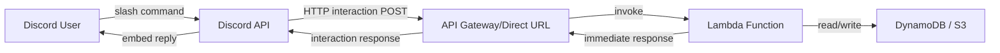

# Discord Bot for Meal Headcount Planner (MHP)

```
Niloy Gabriel Gomes
Feb 26, 2026
Status: Draft - Pending Review
```
---

## Summary
This document outlines the development of a Discord bot for Meal Headcount Planner (MHP). The bot will provide a user-friendly interface/discord message for employees to view and manage their meal participation, as well as for team leads and admins to manage meal participation for their teams and employees, respectively. It also provides the development specification for the meal headcount reporting and other information/statistics, including, work location splits and special day information. The bot will be used to notify employees about their meal participation, as well as for team leads and admins to manage meal participation for their teams and employees.

---

## Problem statement
* Employees currently lack a fast, integrated way to update their meal preferences and work locations seamlessly within their daily communication tool (Discord).
* Administrators and Team Leads struggle to quickly gather headcount summaries for specific dates, leading to inefficiencies in meal planning, tracking, and logistics.
* The existing system lacks a functional, component-based web dashboard that provides real-time, shared-state updates for effective monitoring.

---

## Goals and non-goals

### Goals
- Implement a Discord bot for employees to self-update meal participation and work location (Office/WFH) for a given date.
- Enable Team Leads and Admins/Logistics to fetch daily rollups and summaries via the Discord bot.
- Develop a component-based web dashboard with live updates, shared state, and rich data views (meal totals, work location splits, special days).
- Implement serverless on-demand summary generation (Lambda + EventBridge) triggered by admins.
- Cutoff time configurable by admin (default: 9 PM Dhaka time)

### Non-goals
* Building a completely new identity management system (we will rely on existing auth/Discord IDs).
* Mobile application development (the web dashboard will handle standard browser viewing, Discord bot handles mobile implicitly).
* Automated ordering to logistics team (only tracking the headcount).

---

## Tech stack and rationale (short)
- **Backend language/runtime**: Python 3.12.x – Language of choice for backend and discord bot.
- **Framework**: AWS Lambda + API Gateway (Python handlers) – Serverless compute; each Discord interaction invokes a Lambda function, eliminating the need for a persistent server.
- **Data store**: DynamoDB – Primary data store for meal participation records and headcount data. S3 – Secondary storage, temporary storage for iteration 1 but possibility of keeping as storage option for generated summary reports.
- **Infra/deploy**: AWS (Lambda, API Gateway or Direct URL, DynamoDB, S3, EventBridge) – fully serverless, scales to zero, no persistent servers to manage, reproducible via IaC.
- **Integrations**: Discord HTTP Interactions (`discord-interactions` / `PyNaCl`) – handles slash commands and interactive components via Discord's interactions endpoint; serverless-compatible (no persistent gateway connection required).

---

## Scope of changes
- **Discord Bot**: Application commands (slash commands) and interactive message components for user updates and admin summaries.
- **Backend API**: Lambda functions behind API Gateway or using direct Lambda URL to handle Discord interaction callbacks and serve summary data to the dashboard.

## Requirements
### Functional requirements
- Employees can update meal participation and work location (Office/WFH) for a selected date via the bot.
- The bot replies with a status summary after each update.
- TLs can request a team-level summary for a selected date via the bot.
- Admins/Logistics can request overall headcount summaries for a selected date via the bot.
- Admin/Logistics dashboard displays meal totals, location splits (Office vs WFH), and special day indicators.
- TL dashboard displays team participation list and rollups.
- Dashboard updates immediately as filters (date, meal type, WFH) or employee changes.
- Admin can trigger on-demand daily summary generation (via Lambda invocation) which reflects its state ("in progress" → "ready") in the bot reply.

### Role-based behavior
- **Employee**: Can only read and update their own meal and location status.
- **Team Lead (TL)**: Can view team-level summaries and individual statuses within their team.
- **Admin/Logistics**: Can view all summaries, overall stats, and trigger on-demand report generation.

### Validation rules + edge cases
- Updates past the cut-off time or for past dates are not permitted.
- Handle concurrent filter changes on the UI gracefully.
- WFH is only set to 5 days a month

### Definition of Done
- Discord bot responds to slash commands accurately.
- Serverless report generation runs reliably and posts results to the Discord channel/direct message.

---

## User flows

### Employee self-update
1. User types `/meal-update` in Discord and selects the date for which they want to update their meal participation and work location.
2. Bot replies with the employee's current status summary and interactive buttons/emoji selectors (Office/WFH, Meal Yes/No).
3. User clicks "Office" and "Meal Yes".
4. Bot updates record in storage and replies with a confirmation summary of the user's current status.

### Team Lead summary
1. Team Lead types `/team-summary` in Discord.
2. Bot replies with the team's current status summary based on his team tag in discord server.
3. Team Lead can filter by date, meal type, and WFH status.

### Admin summary
1. Admin types `/headcount-summary` in Discord.
2. Bot replies with the overall headcount summary based on his admin tag in discord server.
3. Admin can filter by date, meal type, and WFH status.

### Admin/Team Lead override
1. Admin/Team Lead types `/override-update` in Discord.
2. Bot replies with the options for available employees and dates for override.
3. Admin/Team Lead selects the employee and the date for which they want to override meal status or WFH status for that employee.
4. Bot updates record in storage and replies with a confirmation summary of the override.
5. Team Lead can only override employees in their team (filtered by discord tags).
6. Admin/Team Lead can bulk update the statuses with the same command but with multiple employees and dates.

---

## Design

### Discord Bot Commands

```
/meal-update - Update your meal participation and work location for a specific date.
/team-summary - View your team's meal participation summary.
/headcount-summary - View the overall headcount summary (Admin only).
/override-update - Override an employee's meal participation or work location (Admin/Team Lead only).
```

### Data Flow

```
User -> Discord -> API Gateway/Direct URL -> Lambda(Backend) -> DynamoDB/S3 -> Lambda(Backend) -> Discord API-> Discord
```


---

## Key decisions and trade-offs

- **Data store**: DynamoDB – Primary data store for meal records and headcount. S3 – Secondary storage for generated report files.
- **Infra/deploy**: AWS Lambda, API Gateway/Direct URL, DynamoDB, S3, EventBridge – fully serverless architecture; scales to zero, no persistent infrastructure to operate.
- **Integrations**: Discord HTTP Interactions (`discord-interactions` / `PyNaCl`) – slash commands and message components via Discord's interactions endpoint; compatible with stateless Lambda invocations.
- Scheduled and on-demand report generation handled by Lambda functions triggered via EventBridge rules; results posted back to Discord via the Discord API.

---

## Security and access control

- **Authentication**: Discord OAuth2 – ensures only authorized users can interact with the bot.
- **Authorization**: Discord roles – ensures only authorized users can access specific commands.
- **Data validation**: Input validation – ensures only valid data is stored in the database.

---

## Testing plan

- **Unit tests**: Unit tests for each component of the bot.
- **Integration tests**: Integration tests for the bot and the database.
- **End-to-end tests**: End-to-end tests for the bot and the database.
