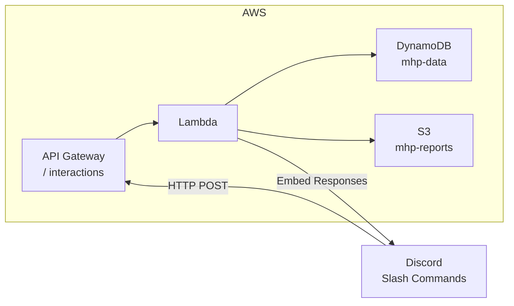

Based on my analysis of the codebase, here's a comprehensive assessment:

## Lambda Function Readiness Analysis

### ✅ Already Lambda-Ready Components

**1. Lambda Handler ([`lambda_handler()`](Task2_mhp_discord-bot/backend/src/handlers/interaction.py:159))**
- Already implemented as an AWS Lambda handler
- Accepts standard Lambda `event` and `context` parameters
- Returns proper API Gateway-compatible responses with `statusCode`, `headers`, and `body`
- Handles Discord interaction types: PING, APPLICATION_COMMAND, MESSAGE_COMPONENT

**2. DynamoDB Integration ([`DynamoDBStorage`](Task2_mhp_discord-bot/backend/src/storage/dynamodb.py:16))**
- Fully implemented with single-table design using PK/SK pattern
- Operations for:
  - Users (`get_user`, `put_user`)
  - Meal participation (`get_meal`, `put_meal`, `get_meals_for_date`)
  - Work locations (`get_location`, `put_location`, `get_locations_for_date`)
  - Special days and policies
- Uses boto3 resource pattern (Lambda-compatible)

**3. Services Layer**
- [`MealService`](Task2_mhp_discord-bot/backend/src/services/meal_service.py:28) - handles meal toggle logic
- [`LocationService`](Task2_mhp_discord-bot/backend/src/services/location_service.py:19) - handles WFH location with monthly cap

**4. Slash Commands Implemented**
| Command | Handler | Features |
|---------|---------|----------|
| `/meal-update` | [`handle_meal_update()`](Task2_mhp_discord-bot/backend/src/handlers/meal_handler.py:106) | Date selection, button toggles |
| `/work-location` | [`handle_work_location()`](Task2_mhp_discord-bot/backend/src/handlers/location_handler.py:109) | Office/WFH with cap validation |

**5. Dependencies** ([`requirements.txt`](Task2_mhp_discord-bot/backend/requirements.txt))
- Already Lambda-compatible: `boto3`, `aws-lambda-powertools`, `pydantic`, `PyNaCl`

### ⚠️ Infrastructure Gap

The [`template.yaml`](Task2_mhp_discord-bot/backend/infrastructure/template.yaml) exists but is **incomplete**:
- DynamoDB table defined ✅
- S3 bucket defined ✅
- Lambda function placeholder exists but **not fully configured**
- IAM role incomplete
- API Gateway not configured

---

## Timeline Estimate

| Phase | Effort | Notes |
|-------|--------|-------|
| **Complete SAM template** | 1-2 hours | Configure Lambda function properties, IAM role, API Gateway |
| **Add Discord webhook URL setup** | 30 mins | Instructions for Discord developer portal |
| **Configure environment variables** | 15 mins | Discord keys, table name in Parameter Store/Secrets Manager |
| **Deploy and test** | 1-2 hours | `sam build && sam deploy` |

### **Total: ~3-5 hours** to have a fully working Lambda-based Discord bot

---

## Architecture Overview

---

## Key Recommendations

1. **Complete the SAM template** - The Lambda function reference needs:
   - `Handler: src.handlers.interaction.lambda_handler`
   - Environment variables mapping
   - VPC settings (if needed)
   - Proper IAM permissions for DynamoDB/S3

2. **Use aws-lambda-powertools** - Already in requirements.txt but not utilized. Adds:
   - Structured logging
   - Metrics/tracing
   - Lambda cold start optimization

3. **Consider Lambda URL** instead of API Gateway for cost savings (if no auth needed on the endpoint)

**Bottom line**: The core application code is **already Lambda-ready**. You can deploy in **3-5 hours** once the SAM template is completed and infrastructure is configured.