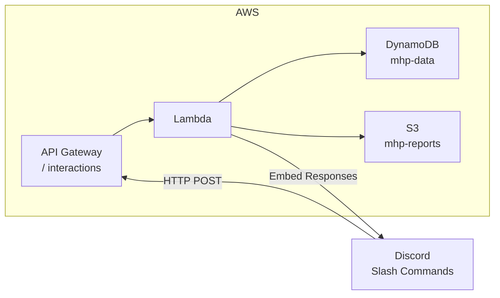

Based on my analysis of the codebase, here's a comprehensive assessment:

## Lambda Function Readiness Analysis

### ✅ Already Lambda-Ready Components

**1. Lambda Handler ([`lambda_handler()`](Task2_mhp_discord-bot/backend/src/handlers/interaction.py:159))**
- Already implemented as an AWS Lambda handler
- Accepts standard Lambda `event` and `context` parameters
- Returns proper API Gateway-compatible responses with `statusCode`, `headers`, and `body`
- Handles Discord interaction types: PING, APPLICATION_COMMAND, MESSAGE_COMPONENT

**2. DynamoDB Integration ([`DynamoDBStorage`](Task2_mhp_discord-bot/backend/src/storage/dynamodb.py:16))**
- Fully implemented with single-table design using PK/SK pattern
- Operations for:
  - Users (`get_user`, `put_user`)
  - Meal participation (`get_meal`, `put_meal`, `get_meals_for_date`)
  - Work locations (`get_location`, `put_location`, `get_locations_for_date`)
  - Special days and policies
- Uses boto3 resource pattern (Lambda-compatible)

**3. Services Layer**
- [`MealService`](Task2_mhp_discord-bot/backend/src/services/meal_service.py:28) - handles meal toggle logic
- [`LocationService`](Task2_mhp_discord-bot/backend/src/services/location_service.py:19) - handles WFH location with monthly cap

**4. Slash Commands Implemented**
| Command | Handler | Features |
|---------|---------|----------|
| `/meal-update` | [`handle_meal_update()`](Task2_mhp_discord-bot/backend/src/handlers/meal_handler.py:106) | Date selection, button toggles |
| `/work-location` | [`handle_work_location()`](Task2_mhp_discord-bot/backend/src/handlers/location_handler.py:109) | Office/WFH with cap validation |

**5. Dependencies** ([`requirements.txt`](Task2_mhp_discord-bot/backend/requirements.txt))
- Already Lambda-compatible: `boto3`, `aws-lambda-powertools`, `pydantic`, `PyNaCl`

### ⚠️ Infrastructure Gap

The [`template.yaml`](Task2_mhp_discord-bot/backend/infrastructure/template.yaml) exists but is **incomplete**:
- DynamoDB table defined ✅
- S3 bucket defined ✅
- Lambda function placeholder exists but **not fully configured**
- IAM role incomplete
- API Gateway not configured

---

## Timeline Estimate

| Phase | Effort | Notes |
|-------|--------|-------|
| **Complete SAM template** | 1-2 hours | Configure Lambda function properties, IAM role, API Gateway |
| **Add Discord webhook URL setup** | 30 mins | Instructions for Discord developer portal |
| **Configure environment variables** | 15 mins | Discord keys, table name in Parameter Store/Secrets Manager |
| **Deploy and test** | 1-2 hours | `sam build && sam deploy` |

### **Total: ~3-5 hours** to have a fully working Lambda-based Discord bot

---

## Architecture Overview



---

## Key Recommendations

1. **Complete the SAM template** - The Lambda function reference needs:
   - `Handler: src.handlers.interaction.lambda_handler`
   - Environment variables mapping
   - VPC settings (if needed)
   - Proper IAM permissions for DynamoDB/S3

2. **Use aws-lambda-powertools** - Already in requirements.txt but not utilized. Adds:
   - Structured logging
   - Metrics/tracing
   - Lambda cold start optimization

3. **Consider Lambda URL** instead of API Gateway for cost savings (if no auth needed on the endpoint)

**Bottom line**: The core application code is **already Lambda-ready**. You can deploy in **3-5 hours** once the SAM template is completed and infrastructure is configured.

---

## Guide A: AWS Resource Setup (Company Account)

### Constraints
- Company account with limited permissions
- Create a **separate IAM role** — don't touch existing user roles
- All resources prefixed with **`trainee-2026-niloy`**

### Resource Naming

| Resource | Name |
|----------|------|
| IAM Role | `trainee-2026-niloy-mhp-lambda-role` |
| DynamoDB Table | `trainee-2026-niloy-mhp-data` |
| S3 Bucket | `trainee-2026-niloy-mhp-reports` |
| Lambda Function | `trainee-2026-niloy-mhp-discord` |
| API Gateway / Function URL | `trainee-2026-niloy-mhp-api` |
| CloudFormation Stack | `trainee-2026-niloy-mhp-stack` |

### Steps

**Step 1 — Verify AWS CLI access**
- `aws sts get-caller-identity` — confirm credentials, note account ID & region

**Step 2 — Create IAM Role for Lambda** (IAM → Roles → Create Role)
- Trusted entity: **AWS Service → Lambda**
- Name: `trainee-2026-niloy-mhp-lambda-role`
- Attach: `AWSLambdaBasicExecutionRole` (managed policy — CloudWatch Logs)
- Create **inline policy** `trainee-2026-niloy-mhp-policy`:
  - DynamoDB: `GetItem`, `PutItem`, `Query`, `Scan` — scope to `arn:aws:dynamodb:*:*:table/trainee-2026-niloy-mhp-data`
  - S3: `GetObject`, `PutObject` — scope to `arn:aws:s3:::trainee-2026-niloy-mhp-reports/*`
- Tag: `Project = trainee-2026-niloy-mhp`

**Step 3 — Create DynamoDB Table** (DynamoDB → Create Table)
- Table name: `trainee-2026-niloy-mhp-data`
- Partition key: `PK` (String) / Sort key: `SK` (String)
- Capacity mode: **On-demand** (PAY_PER_REQUEST)
- Tag: `Project = trainee-2026-niloy-mhp`

**Step 4 — Create S3 Bucket** (S3 → Create bucket)
- Name: `trainee-2026-niloy-mhp-reports`
- Region: `ap-southeast-1`
- Block all public access: **ON**
- Encryption: SSE-S3 (AES-256)
- Versioning: Enabled

**Step 5 — Create Lambda Function** (Lambda → Create function)
- Name: `trainee-2026-niloy-mhp-discord`
- Runtime: **Python 3.12**
- Execution role: **Use existing** → `trainee-2026-niloy-mhp-lambda-role`
- Handler: `src.handlers.interaction.lambda_handler`
- Timeout: 30s, Memory: 256 MB
- Set environment variables (see `.env` below)

**Step 6 — Create endpoint** (pick one)
- **Option A — Lambda Function URL** (simpler, free):
  - Lambda → Configuration → Function URL → Create
  - Auth type: **NONE** (Discord verifies via Ed25519 signature)
  - Copy the URL (e.g. `https://abc123.lambda-url.ap-southeast-1.on.aws/`)
- **Option B — API Gateway REST API**:
  - Create REST API named `trainee-2026-niloy-mhp-api`
  - Resource `/interactions`, method `POST` → integrate with Lambda
  - Deploy to stage `dev`

**Step 7 — Deploy code**
- Package: `pip install -r requirements.txt -t package/ && cd package && zip -r ../deployment.zip . && cd .. && zip -r deployment.zip src/`
- Upload: `aws lambda update-function-code --function-name trainee-2026-niloy-mhp-discord --zip-file fileb://deployment.zip`
- Or use SAM if you have CloudFormation permissions: `sam build && sam deploy`

> **If SAM deploy fails** due to CloudFormation/IAM permission limits on the company account, create resources manually via Console (Steps 2–6) and deploy code via CLI in Step 7. The code is the same either way.

---

## Guide B: Discord Bot Setup

### Step 1 — Create Discord Application
1. Go to https://discord.com/developers/applications
2. **New Application** → name it "MHP Meal Planner" (or similar)
3. Copy from **General Information** tab:
   - **Application ID** → `DISCORD_APPLICATION_ID` and `DISCORD_CLIENT_ID`
   - **Public Key** (hex string) → `DISCORD_PUBLIC_KEY`

### Step 2 — Create Bot User
1. Left sidebar → **Bot**
2. Click **Reset Token** → copy immediately (shown once) → `DISCORD_BOT_TOKEN`
3. Privileged Gateway Intents: **none needed** (HTTP interactions don't use gateway)
4. Public Bot: **OFF** (only your server)

### Step 3 — Get OAuth2 Credentials
1. Left sidebar → **OAuth2**
2. Copy **Client Secret** → `DISCORD_CLIENT_SECRET`

### Step 4 — Invite Bot to Server
1. **OAuth2 → URL Generator**
2. Scopes: `bot`, `applications.commands`
3. Bot Permissions: `Send Messages`, `Use Slash Commands`
4. Copy URL → open in browser → select your server → **Authorize**

### Step 5 — Create Discord Server Roles

Create these 3 roles in **Server Settings → Roles**:

| Role Name | Color (suggested) | Purpose | Who Gets It |
|-----------|-------------------|---------|-------------|
| **MHP-Admin** | Red | Override, headcount, policies | Server admins / logistics |
| **MHP-TeamLead** | Orange | Team-scoped views + override | Team leads |
| **MHP-Employee** | Blue | Self-update meals & location | All employees |

After creating, **right-click each role → Copy ID** (requires Developer Mode):
- `MHP-Admin` ID → `ROLE_ADMIN_ID`
- `MHP-TeamLead` ID → `ROLE_TEAM_LEAD_ID`
- `MHP-Employee` — no ID needed (default fallback role)

**Enable Developer Mode**: User Settings → Advanced → Developer Mode → ON

### Step 6 — Get Server (Guild) ID
- Right-click your server name → **Copy Server ID** → `DISCORD_GUILD_ID`

### Step 7 — Set Interactions Endpoint URL (after AWS deploy)
1. Discord Developer Portal → **General Information**
2. Paste your Lambda Function URL / API Gateway endpoint into **Interactions Endpoint URL**
3. Discord sends a PING → Lambda responds `{"type": 1}` → saves if successful

### Step 8 — (Optional) Team Roles
For team-based scoping, create roles like `Team-Backend`, `Team-Frontend`, etc. Their role ID → team name mapping gets stored in DynamoDB as a policy record.

---

### Complete `.env` After Both Guides

```
DISCORD_PUBLIC_KEY=<hex from General Information>
DISCORD_APPLICATION_ID=<from General Information>
DISCORD_CLIENT_ID=<same as Application ID>
DISCORD_CLIENT_SECRET=<from OAuth2>
DISCORD_BOT_TOKEN=<from Bot tab>
DISCORD_GUILD_ID=<right-click server → Copy ID>
DISCORD_REDIRECT_URI=

ROLE_ADMIN=MHP-Admin
ROLE_TEAM_LEAD=MHP-TeamLead
ROLE_EMPLOYEE=MHP-Employee
ROLE_ADMIN_ID=<right-click MHP-Admin role → Copy ID>
ROLE_TEAM_LEAD_ID=<right-click MHP-TeamLead role → Copy ID>

DYNAMODB_TABLE_NAME=trainee-2026-niloy-mhp-data
S3_BUCKET=trainee-2026-niloy-mhp-reports
S3_PREFIX=reports/
CUTOFF_TIME=21:00
WFH_MONTHLY_CAP=5
FORWARD_PLANNING_DAYS=7
TIMEZONE=Asia/Dhaka
DEBUG=true
```

Both guides are saved to session memory. The `trainee-2026-niloy` prefix carries through to the SAM template when we update it — the defaults in config.py (`MHP-Data`, `mhp-reports`) will be overridden by the env vars at runtime. Ready to start implementation whenever you are.

--------------------------------------------------------------------------------------------------------
--------------------------------------------------------------------------------------------------------

## Plan: Deploy MHP Discord Bot to Lambda

The core application code (Lambda handler, DynamoDB storage, meal/location services, auth) is **already fully implemented**. The main gap is the **incomplete SAM template** and a missing **slash command registration script**. This plan completes the infrastructure, registers Discord commands, and deploys to AWS — getting `/meal-update` and `/work-location` working end-to-end via Discord.

---

### Phase 1: Complete SAM Template *(blocks everything)*

**File**: template.yaml

1. **Fill `InteractionFunction`** — Set `Handler: src.handlers.interaction.lambda_handler`, `Runtime: python3.12`, `CodeUri: ../` (so `src/` is packaged), env vars mapped from Parameters (`DISCORD_PUBLIC_KEY`, `DISCORD_APPLICATION_ID`, `DISCORD_BOT_TOKEN`, `DISCORD_GUILD_ID`, `DYNAMODB_TABLE_NAME` → `!Ref DynamoDBTable`, `S3_BUCKET` → `!Ref S3Bucket`, policy configs)
2. **Complete `LambdaExecutionRole`** — `AWSLambdaBasicExecutionRole` managed policy + inline DynamoDB (`GetItem`, `PutItem`, `Query`, `Scan`) + S3 (`GetObject`, `PutObject`) permissions, scoped to the created resources
3. **Configure API Gateway** — Use SAM `Events` property on the function: `Api` event type, `POST /interactions`, auto-generates API Gateway + invoke permission (cleaner than separate `DiscordApi` + `Permission` resources)
4. **Add missing Parameters** — `RoleAdminId`, `RoleTeamLeadId`, `CutoffTime` (default "21:00"), `WfhMonthlyCap` (default 5), `ForwardPlanningDays` (default 7)
5. **Complete Outputs** — Table name, bucket name, API endpoint URL, function ARN

### Phase 2: Create Slash Command Registration Script *(parallel with Phase 1)*

6. **Create `scripts/register_commands.py`** — Hits Discord REST API `PUT /applications/{app_id}/guilds/{guild_id}/commands` to register `/meal-update` and `/work-location` (each with optional `date` STRING option). One-time local script using `DISCORD_BOT_TOKEN` + `DISCORD_APPLICATION_ID` from env.

### Phase 3: Deploy & Wire Up

7. **Create `samconfig.toml`** — Stack name, region, parameter overrides
8. **`sam validate`** → **`sam build`** → **`sam deploy --guided`** 
9. **Set Interactions Endpoint URL** in Discord Developer Portal → Discord sends PING → Lambda responds `{"type": 1}` → saves successfully
10. **Run `register_commands.py`** → commands appear in Discord server

### Phase 4: End-to-End Verification

11. `/meal-update` in Discord → embed with Lunch/Snacks toggle buttons → toggle → DynamoDB updated → embed refreshed
12. `/work-location` → Office/WFH buttons → set WFH → DynamoDB record created → WFH cap enforced
13. `pytest tests/` — all existing tests pass

### Phase 5: Seed Initial Data *(if needed)*

14. **Create `scripts/seed_data.py`** — Seed `team_role_map` policy in DynamoDB (maps Discord role IDs → team names)

---

### Relevant Files

**Already complete (no changes needed):**
- interaction.py — Lambda entry point, signature verification, routing
- meal_handler.py — `/meal-update` + toggle buttons
- location_handler.py — `/work-location` + set buttons
- auth.py — Role mapping + command authorization
- dynamodb.py — Full DynamoDB CRUD
- meal_service.py — Meal toggle logic
- location_service.py — Location + WFH cap
- config.py — Settings from env vars
- models.py — All Pydantic models
- utils.py — Date/time validation

**Needs completion:**
- template.yaml — SAM template (Phase 1)

**New files:**
- `scripts/register_commands.py` — Discord command registration
- `infrastructure/samconfig.toml` — Deployment defaults
- `scripts/seed_data.py` — Initial DynamoDB seed data
- `events/ping.json` — SAM local test event (optional)

---

### Verification

1. `sam validate -t template.yaml` — no errors
2. `sam build && sam deploy` — CloudFormation stack creates all resources
3. Discord PING handshake succeeds when setting Interactions Endpoint URL
4. `/meal-update` and `/work-location` work end-to-end in Discord
5. `pytest tests/` — existing tests pass

### Decisions

- **SAM Events pattern** over separate API Gateway resource (auto-generates API + permission)
- **Guild commands** for instant availability during dev (switch to global for prod)
- **`bot/` directory unused** — Lambda handles Discord HTTP interactions directly, no persistent bot process
- **Override handler out of scope** — tests exist but implementation deferred (focus on meal + location today)

### Further Considerations

1. **AWS Credentials** — Need configured AWS CLI profile before deployment. Recommendation: confirm credentials/region first.
2. **Discord Application** — Need Application ID, Bot Token, Public Key, Guild ID from Developer Portal. If not created yet, create the application first.
3. **Lambda deps packaging** — Start with SAM's built-in `pip install` packaging. Optimize to Lambda Layer later if cold starts are slow.